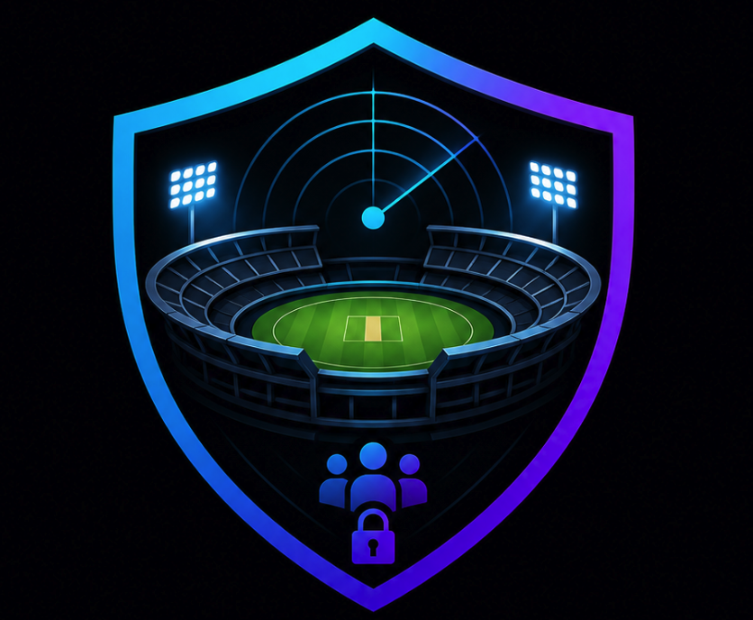

# StadiumSOC


<p align="center">
  
</p>

<h3 align="center">
AI-Powered Stadium Security Operations Center
</h3>

<p align="center">
Real-Time Crowd Intelligence • AI Incident Orchestration • Smart Ingress Monitoring • Cyber-Physical Stadium Security
</p>

---

# 🎥 Demo Preview


## 🚀 Live Demo

🔗 https://stadiumsoc-ai.web.app

---

# 📚 Table of Contents

- Overview
- Key Features
- System Architecture
- Tech Stack
- Installation
- Deployment
- Screenshots
- Security Features
- Future Scope
- Contributing
- License

# 📌 Overview

StadiumSOC is an AI-powered Security Operations Center (SOC) platform designed for modern cricket stadiums and large-scale sporting events.

The platform combines:
- real-time crowd telemetry,
- smart ingress monitoring,
- QR ticket validation,
- RBAC-based command systems,
- AI-powered incident orchestration,
- emergency response coordination,
- live stadium visualization.

Built for high-density public venues, StadiumSOC transforms stadium operations into a centralized intelligent command infrastructure.

---

# 🧠 Key Features

## 🎟️ Smart Ticket Validation
- QR-based ticket verification
- Duplicate ticket fraud detection
- Real-time ingress monitoring
- Gate-level occupancy tracking

## 🏟️ Interactive Stadium Intelligence
- Live SVG stadium map
- Sector-wise telemetry
- Dynamic crowd heatmaps
- Gate congestion visualization

## 🤖 AI Operations Center
Powered by Google Gemini AI SDK:
- SOP generation
- AI incident response
- Emergency recommendations
- Automated operational insights

## 🔐 RBAC Security Architecture
Role-specific access for:
- SOC Commanders
- Sector Officers
- Gate Officers
- VIP Security
- Medical Teams

## 🚨 Incident Matrix
- Crowd surge detection
- Unauthorized access alerts
- VIP threat escalation
- Security lockdown workflows

---

# 🏗️ System Architecture

```text
Frontend (React + Vite)
        │
        ▼
Firebase Hosting
        │
        ▼
Firebase Realtime Database
        │
        ▼
Node.js + Express Backend
        │
        ▼
Google Gemini AI SDK
        │
        ▼
AI Incident Orchestration Engine

# 🛡️ Security Capabilities

- Role-Based Access Control (RBAC)
- Threat Escalation Engine
- AI Incident Prioritization
- Crowd Risk Analytics
- VIP Zone Protection
- Secure Ticket Validation
- Real-Time Threat Telemetry
